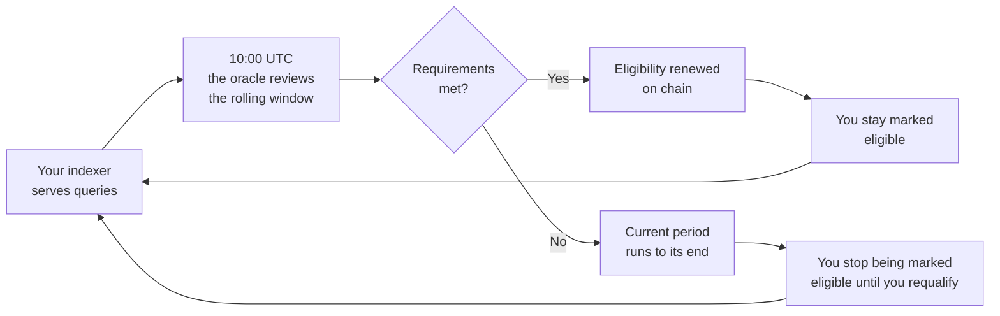
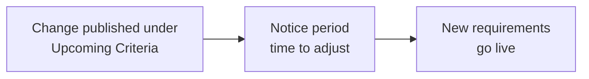

<div align="center">


# Rewards Eligibility Oracle

**Deciding who is eligible for indexing rewards on The Graph**

[](https://github.com/graphprotocol/rewards-eligibility-oracle/actions/workflows/ci.yml) [](https://github.com/graphprotocol/rewards-eligibility-oracle/releases) [](https://arbiscan.io/address/0x02753bae61c08abd4351bce7f48524935c2cc78e) [](https://hub.thegraph.foundation/reo/)

[At a glance](#at-a-glance) | [How it works](#how-eligibility-works) | [What is measured](#what-the-oracle-measures) | [Check your status](#check-where-you-stand) | [When requirements change](#when-the-requirements-change) | [On chain](#where-eligibility-is-recorded) | [Questions](#common-questions)

</div>

---

This oracle decides which indexers on The Graph are eligible for indexing rewards, and records that decision on chain. Once a day it reviews the queries each indexer answered, works out who meets the published requirements, and renews eligibility for those addresses in the [RewardsEligibilityOracle](https://arbiscan.io/address/0x02753bae61c08abd4351bce7f48524935c2cc78e) contract on Arbitrum One.

If you run an indexer, this repository is where you find out what is being measured, what the requirements currently are, when they are going to change, and how to check where you stand.

---

## At a glance

| Question | Answer |
|---|---|
| **When the oracle runs** | Every day at 10:00 UTC |
| **What the oracle looks at** | The queries your indexer served over a rolling window |
| **What the requirements are** | See the [ELIGIBILITY_CRITERIA.md](./ELIGIBILITY_CRITERIA.md#active-eligibility-criteria) |
| **Where the decision is recorded** | [RewardsEligibilityOracle on Arbitrum One](https://arbiscan.io/address/0x02753bae61c08abd4351bce7f48524935c2cc78e) |
| **How to see your status** | [The Foundation dashboard](https://hub.thegraph.foundation/reo/) for a quick look, [the contract](#check-where-you-stand) for the definitive answer |

---

## How eligibility works

Eligibility is granted for a fixed period rather than permanently. Every day the oracle renews eligibility for each indexer that still meets the [eligibility requirements](./ELIGIBILITY_CRITERIA.md#active-eligibility-criteria), so while you keep qualifying your eligibility keeps rolling forward.



If you stop qualifying, your eligibility is not revoked on the spot. Your current period runs to its end without being renewed, and from then on you are no longer marked eligible until you qualify again. A change to the requirements works the same way: it does not cut short a period that has already been granted to you.

---

## Check where you stand

The Graph Foundation publishes a [dashboard](https://hub.thegraph.foundation/reo/) listing every indexer and their current status. Search it by address or ENS name to find yourself, and it will show whether you are currently eligible, when you were last renewed, and how much of that renewal is left. Adding `?indexer=0x...` to the URL opens a single indexer directly. It is the quickest way to check, though the contract rather than the dashboard is the source of truth.

To go straight to the source, open the [Read as Proxy tab](https://arbiscan.io/address/0x02753bae61c08abd4351bce7f48524935c2cc78e#readProxyContract) on Arbiscan and call:

| Call | What it tells you |
|---|---|
| `isEligible(your address)` | Whether the contract considers you eligible right now |
| `getEligibilityRenewalTime(your address)` | The Unix timestamp of your most recent renewal, or `0` if you have never been renewed |
| `getEligibilityPeriod()` | How long a single renewal lasts, in seconds |
| `getEligibilityValidation()` | Whether the contract is enforcing eligibility at all |

Your current period ends at your renewal time plus the eligibility period. Every time the oracle renews you, that clock restarts.

<details>
<summary>The same checks from a terminal</summary>

Using [Foundry](https://book.getfoundry.sh/):

```bash
CONTRACT=0x02753BaE61C08AbD4351Bce7F48524935C2Cc78E
RPC=https://arb1.arbitrum.io/rpc
YOU=0xYourIndexerAddress

cast call $CONTRACT "isEligible(address)(bool)" $YOU --rpc-url $RPC
cast call $CONTRACT "getEligibilityRenewalTime(address)(uint256)" $YOU --rpc-url $RPC
cast call $CONTRACT "getEligibilityPeriod()(uint256)" --rpc-url $RPC
```

</details>

---

## When the requirements change



Planned changes are published under [Upcoming Eligibility Criteria](./ELIGIBILITY_CRITERIA.md#upcoming-eligibility-criteria) before they take effect, with a notice period between the announcement and the change going live so there is time to adjust. Changes are announced through official channels as well, so you do not have to watch this repository to hear about them.

Every past change is recorded in the [changelog](./ELIGIBILITY_CRITERIA.md#eligibility-requirements-changelog) at the end of that same document, which lets you work out which requirements applied on any given date.

---

## Where eligibility is recorded

Every renewal is written to the contract, so who was marked eligible, and when, is public and permanent.

| Network | Chain ID | Contract |
|---------|----------|----------|
| Arbitrum One | 42161 | [`0x02753BaE61C08AbD4351Bce7F48524935C2Cc78E`](https://arbiscan.io/address/0x02753bae61c08abd4351bce7f48524935c2cc78e) |
| Arbitrum Sepolia | 421614 | [`0x62c2305739CC75f19a3A6d52387CEb3690D99A99`](https://sepolia.arbiscan.io/address/0x62c2305739cc75f19a3a6d52387ceb3690d99a99) |

---

## Common questions

<details>
<summary>I have just started indexing. When can I become eligible?</summary>

As soon as you have accumulated enough active days inside the rolling window. The window and the number of days are in [ELIGIBILITY_CRITERIA.md](./ELIGIBILITY_CRITERIA.md#active-eligibility-criteria). The first daily run after you meet the requirements will mark you eligible.

</details>

<details>
<summary>I stopped serving queries. When do I lose eligibility?</summary>

Not straight away. Your last renewal stands until it expires, which is the renewal timestamp plus the eligibility period. Both values are readable on the contract, so you can work out the exact moment.

</details>

<details>
<summary>Why does isEligible say true when I have never been renewed?</summary>

Because enforcement is switched off. While `getEligibilityValidation` reads false, the contract answers true for every address, whether the oracle has ever renewed it or not.

</details>

<details>
<summary>The requirements changed while I was eligible. Am I cut off?</summary>

No. A period that has already been granted to you runs its full course. The new requirements apply from your next renewal onwards.

</details>

<details>
<summary>Which of my queries count?</summary>

Only the query attempts the network recorded as routed to your indexer, and among those, only the ones that met every quality bar at the same time. Response code, response time and distance behind chainhead are all judged on the same query.

</details>

---

## Working on the oracle itself

How the service is built, and how it behaves when an RPC provider fails, are described in the [technical design document](./docs/technical-design.md).

---

## License

License information to be determined.
