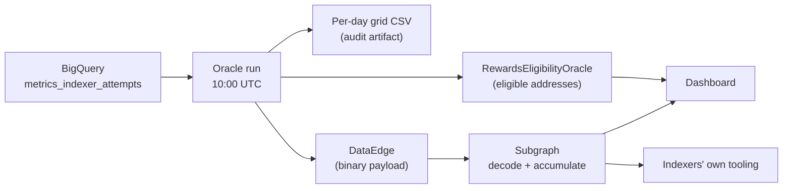

# Plan: publishing per-day eligibility metrics

**Status:** Phases 1 and 2 implemented. Publishing is switched off until a DataEdge contract is
deployed and `DATA_EDGE_CONTRACT_ADDRESS` is set. Phases 3 and 4 not started.
**Scope:** `rewards-eligibility-oracle`, a new subgraph, `rewards-eligibility-oracle-dashboard`

## Problem

The oracle decides eligibility from 28 days of query data, then posts **only the eligible
addresses** on chain. Everything that justified the decision is discarded at the end of the run.

That leaves indexers with a single bit of information, and it is the wrong bit:

- `isEligible` reads identically for an indexer at 22 qualifying days and one at 5. The first is
  safe, the second is one bad day from lapsing, and neither can tell which they are.
- An ineligible indexer learns that it failed, not why. "No queries were routed to me" and
  "I served queries but every one was behind chainhead" are different problems with different
  fixes, and today they look the same.
- `MIN_SUBGRAPHS` changes from 1 to 5 on 2026-10-06. No indexer can currently determine whether
  that affects them, which makes the notice period much less useful than intended.

The data to answer all three is computed inside every run and thrown away before it is written
anywhere.

## Goal

Publish per-indexer, per-day eligibility metrics so that indexers can see **how much margin they
have**, **why a day failed**, and **whether a pending criteria change affects them** — without
having to ask anyone.

Non-goal: changing what determines eligibility. This plan does not alter the criteria, the
contract, or the renewal semantics.

## Current state

### On chain

```solidity
renewIndexerEligibility(address[] indexers, bytes data) returns (uint256)
```

The oracle sends the eligible addresses in batches of `BATCH_SIZE` (125), halting on first
failure, and passes `data = 0x` on every call — `data_bytes` defaults to `b""` in
`blockchain_client.py` and nothing ever sets it. The contract records `block.timestamp` per
address as the renewal time and emits `IndexerEligibilityRenewed(indexer, oracle)`. There is also
an unused `IndexerEligibilityData(address indexed oracle, bytes data)` event.

No metrics, counts, thresholds or scores exist on chain.

### Off chain

Each run writes three CSVs to `data/output/YYYY-MM-DD/` on a PVC with a 120-day sweep:
`indexer_issuance_eligibility_data.csv` (window totals per indexer), `eligible_indexers.csv`,
`ineligible_indexers.csv`. The totals collapse the 28-day window, so per-day detail is already
lost at this point.

### Dashboard

`rewards-eligibility-oracle-dashboard` reads **only the contract** — `isEligible` and
`getEligibilityRenewalTime` per address — into `reo.db`, and renders a static site. Its indexer
roster comes from a subgraph, so it already knows about ineligible indexers; it just has nothing
to say about them.

## Shape of the solution



Four phases. Phase 1 is a prerequisite for everything else and is useful on its own.

---

## Phase 1 — emit the per-day grid (oracle)

Stop collapsing the window before writing. Keep the existing three CSVs untouched and add:

### `data/output/YYYY-MM-DD/indexer_daily_metrics.csv`

One row per indexer per day of the window.

```csv
day,indexer,query_attempts,qualifying_queries,qualifying_subgraphs,failed_status,failed_latency,failed_blocks_behind,is_online_day
2026-09-24,0x32bb…157b,3184,2761,6,102,53,321,1
2026-09-24,0x474e…684c,29,0,0,0,2,29,0
2026-09-25,0x474e…684c,0,0,0,0,0,0,0
```

| Column | Meaning |
| --- | --- |
| `day` | `YYYY-MM-DD` |
| `indexer` | lowercase hex address |
| `query_attempts` | all attempts routed to this indexer that day |
| `qualifying_queries` | attempts meeting all three quality bars simultaneously |
| `qualifying_subgraphs` | distinct deployments with >= 1 qualifying query that day |
| `failed_status` | attempts where `status != '200 OK'` |
| `failed_latency` | attempts where `response_time_ms >= MAX_LATENCY_MS` |
| `failed_blocks_behind` | attempts where `blocks_behind >= MAX_BLOCKS_BEHIND` |
| `is_online_day` | 1 if the day counted toward eligibility, under the thresholds active at run time |

### `data/output/YYYY-MM-DD/run_metadata.json`

Makes each run's artifact self-describing once criteria have changed:

```json
{
  "run_date": "2026-09-25",
  "window_start": "2026-08-28",
  "window_end": "2026-09-25",
  "criteria": { "MIN_ONLINE_DAYS": 5, "MIN_SUBGRAPHS": 1,
                "MAX_LATENCY_MS": 5000, "MAX_BLOCKS_BEHIND": 50000 },
  "source": "bigquery",
  "indexers_evaluated": 189,
  "indexers_eligible": 142
}
```

`source` is `bigquery` or `cache`, reflecting the 30-minute cache path.

### Semantics that consumers must respect

1. **The `failed_*` counts overlap.** One response can be both slow and behind chainhead and
   increments both. They do not sum to `query_attempts - qualifying_queries`. They are not
   components of a whole and must not be rendered as one.
2. **`query_attempts = 0` is a real row**, not missing data — the gateway routed nothing that day,
   which is a routing problem, not a serving problem. Days with no attempts are emitted explicitly.
3. **`is_online_day` is a historical record** computed with the thresholds in `run_metadata.json`.
   Simulation of other thresholds must recompute from `qualifying_queries` / `qualifying_subgraphs`.

### Implementation notes

- **One BigQuery scan.** The query returns the daily grid; the existing summary CSV is aggregated
  from that grid in pandas. `unique_good_response_subgraphs` cannot be derived from per-day
  distinct counts, so it stays a window-level aggregate in SQL and rides denormalized on each row.
- **Densify in pandas, not SQL.** Days with no attempts produce no rows in the source table.
  `tests/test_bigquery_provider.py` runs the generated query against in-memory SQLite, so keeping
  BigQuery-only syntax (`GENERATE_DATE_ARRAY`, `UNNEST`) out of it preserves that test.
- **Cache coherence.** Add both new files to `required_files` in `has_existing_processed_data`, or
  a cache hit can serve a run whose grid is missing. This invalidates existing caches once.
- The existing three CSVs and `process()` keep their current shape and tests.

**Blast radius:** the query and its snapshot, the provider's fetch/aggregate methods, the new
pipeline writers, the cache file list.

### Artifact scope: the CSV stays window-scoped

Decided. The grid covers the full 28-day window even though Phase 2 publishes only one day per
run, and the two shapes stay independent of each other.

- **The decision being audited is window-scoped.** The on-chain write asserts that a set of
  addresses is eligible, which is a function of 28 days rather than of the run date. A single-day
  artifact cannot reproduce the verdict it sits beside; answering "why was this address in
  yesterday's transaction" would mean stitching 28 directories together.
- **Phase 1 ships before the subgraph**, so the CSV is the only record until Phases 2 and 3 land —
  and afterwards it remains the fallback for days when the DataEdge post fails.
- **Overlapping windows expose restatements.** BigQuery can backfill. Comparing consecutive runs'
  view of the same day surfaces source data that moved; with single-day files a silent restatement
  is invisible.

The redundancy costs ~500 KB per run, ~60 MB across the 120-day sweep, against a 5 Gi volume. If
disk ever becomes a constraint the lever is `MAX_AGE_BEFORE_DELETION`, not the window — cutting
retention saves more and loses less. The BigQuery scan is identical either way, since the oracle
must fetch 28 days to decide eligibility at all; this is only a question of what reaches disk.

---

## Phase 2 — publish on chain via DataEdge

`EventfulDataEdge` accepts any calldata on its fallback and emits `Log(bytes data)`. It exists to
carry oracle payloads that a subgraph decodes, and block-oracle already uses this pattern in
production.

### Why not the rewards contract's `data` parameter

It was considered and rejected. `renewIndexerEligibility(address[], bytes)` couples any payload to
the renewal transaction, which means:

- **Only eligible indexers get covered.** Adding an ineligible address to `indexers[]` to carry its
  data would grant it eligibility. The indexers who most need diagnosis are structurally excluded.
- **A zero-eligible day sends no transaction at all**, so no data is published.
- Decoupling the payload from the address array is technically possible, but sending renewal
  transactions for telemetry reasons touches `getLastOracleUpdateTime`, which is paired with
  `getOracleUpdateTimeout` and therefore almost certainly gates a liveness fail-safe. A telemetry
  transaction landing while the renewal path is broken would keep that clock fresh and mask the
  outage. Not acceptable on a rewards-critical contract.

DataEdge has none of these properties: no address coupling, no liveness signal, no governance or
audit surface on the rewards contract.

### Post deltas, not the window

The CSV stays window-scoped for the reasons above. On chain the subgraph accumulates state, so each
run publishes only the **trailing days** of the window. The encoder reads them from the in-memory
grid, not from the CSV — keeping the two independent is what lets the artifact be window-scoped
while the payload is day-scoped.

**Two trailing days, not one** (`DATA_EDGE_PUBLISH_DAYS`, default 2). A run at 10:00 UTC sees only
the first ten hours of its final day, so publishing that day alone would permanently understate it.
Publishing an overlap means the next run restates it. The same overlap covers a day whose own run
failed, and a day whose source data arrived late in BigQuery. Rows are keyed by `(indexer, day)` so
restatement is an upsert.

Measured payload sizes, 200 indexers with a full set of counters:

| Encoding | Per run |
| --- | --- |
| Raw CSV, full window | ~500 KB |
| Raw CSV, one day | ~18 KB |
| **Binary, 2 trailing days** | **~12 KB** (~30 bytes per indexer-day) |
| Binary, 1 trailing day | ~6 KB |

**No address registry in v1**, which is a change from the original sketch. Registering addresses
once and referring to them by index would cut a row from ~30 to ~10 bytes, but it makes the oracle
hold registry state that must stay in lockstep with the subgraph's. If the two ever diverge — a lost
state file, a transaction the oracle recorded but that never landed, a wiped volume — every
subsequent payload decodes against the wrong addresses, silently. Inline addresses are stateless and
idempotent, and the ~8 KB per run they cost is a rounding error against the ~8 KB of calldata the
oracle already sends to renew eligibility. Revisit if the indexer set grows by an order of magnitude.

Absence encodes zero: an indexer with no query attempts on a day contributes no row, and the
subgraph materializes the zero row for it.

### Wire format

Implemented in [`src/utils/data_edge_codec.py`](../src/utils/data_edge_codec.py), which is the
normative reference; the decoder in that module mirrors what a subgraph mapping must do and is what
the tests assert against. All integers are unsigned LEB128 varints, all days are days since
1970-01-01.

```
payload  := magic("RE") version(varint) message*
message  := tag(varint) body

0x01 RunInfo      := run_day, window_start_day, window_end_day,
                     indexers_evaluated, indexers_eligible
0x02 Criteria     := min_online_days, min_subgraphs, max_latency_ms, max_blocks_behind
0x03 DailyMetrics := day, row_count, row*
     row          := address(20 bytes), query_attempts, qualifying_queries, qualifying_subgraphs,
                     failed_status, failed_latency, failed_blocks_behind, is_online_day
```

Three properties worth keeping if the format is revised:

- **Magic bytes.** DataEdge's fallback accepts calls from *any* address, so the subgraph needs a way
  to ignore payloads it did not write. The magic is a cheap first filter; the mapping should also
  check `event.transaction.from` against the oracle address, since the `Log(bytes)` event does not
  carry a sender.
- **Criteria on every payload**, not only when they change. It costs ~6 bytes and it means a payload
  is interpretable with no prior state — `is_online_day` means nothing without the thresholds that
  produced it, and those change (1 -> 5 subgraphs on 2026-10-06).
- **An explicit version**, refused rather than guessed at when unrecognised. The subgraph is a
  deployed artifact that cannot be retroactively fixed.

### Operational requirements

- **A dedicated DataEdge instance.** The fallback emits everything sent to it; a shared contract
  forces the subgraph to filter other payloads out of its event stream.
- **A separate transaction from renewals**, in both directions. Telemetry must never fail an oracle
  run. Conversely, on a run where renewals fail the diagnostic data is *more* valuable, so publishing
  is not conditional on renewal success: the submission failure is held, the payload is published,
  and only then is the failure re-raised. A publishing failure logs and alerts (OpsGenie P4) rather
  than exiting 1.
- **Publishing runs after the renewal batches, not before.** Both sign with the same key, and
  renewals are submitted with `replace=True`, which takes the sender's oldest pending nonce. A
  publish still in flight would be replaced by them and silently dropped — including through
  `_determine_transaction_nonce`'s nonce-gap fallback, which cannot inspect the pending transaction
  to avoid it. Submitting renewals first leaves nothing of ours pending for them to evict. A separate
  signing account would remove the coupling properly, and is the right fix if one ever becomes
  available.
- **Reverts are not retried.** Provider rotation is right for a timeout or an unreachable node, but
  a revert is deterministic: rotating would mine, and pay for, the same failing transaction once per
  configured provider.
- **An ambiguous broadcast is not retried either.** Once `send_raw_transaction` has returned, the
  transaction may be mined whatever happens next, so a failed receipt raises `DataEdgePendingError`
  carrying the hash instead of rotating. Rotating would either duplicate the publish under the next
  nonce or be rejected as an underpriced replacement, with no way to tell which survived. Failures
  before the broadcast still rotate normally, since nothing is in flight.
- **Idempotent by `(indexer, day)`** so catch-up runs, the publish overlap, and late-arriving
  BigQuery data can all restate a day.
- **The cache path does not publish.** A re-run within the 30-minute cache window republishes
  nothing, since the run it is replaying already published.

---

## Phase 3 — subgraph

Decodes `Log(bytes)` into entities and maintains the rolling window.

Rough entity shape:

- `Indexer` — address, registry index, current rolling counts
- `IndexerDay` — `(indexer, day)`, the six counters plus `is_online_day`
- `Criteria` — threshold set with the block range it was active for
- `Run` — run date, indexers evaluated, indexers eligible, transaction

Responsibilities: decode and version-check payloads, materialize zero rows for registered
indexers absent from a day, maintain per-indexer rolling aggregates so consumers do not have to
sum 28 entities, and prune beyond a retention horizon.

Once this exists, **indexers can query their own metrics directly** and build their own alerting
without the dashboard in the loop. That is a better outcome than a dashboard and is only available
on this path.

---

## Phase 4 — dashboard

Adds panels on top of the subgraph. The contract remains the source of truth for eligibility
itself; the subgraph is the source of truth for the metrics behind it.

| Panel | Derivation |
| --- | --- |
| Renewal forecast | rolling online days >= `MIN_ONLINE_DAYS` |
| Headroom | "18 of 28 days qualified, 5 required" |
| Decay warning | qualifying days about to roll off the back of the window |
| 28-day strip | `is_online_day` per day |
| Failure reason | `query_attempts == 0` -> not routed; else the dominant `failed_*` |
| Criteria simulator | re-tally `qualifying_queries >= 1 AND qualifying_subgraphs >= K` for pending `K` |
| Run health / data as-of | latest `Run` entity |

Two states worth rendering explicitly:

- **Qualified but not renewed.** Batches halt on first failure, so a partial run can leave an
  indexer that met the criteria un-renewed until the next day. The contract alone cannot
  distinguish this from failing to qualify; the subgraph plus the contract can.
- **Lapse, not revocation.** A renewal grants a fixed period and failing to qualify does not cut it
  short. Forecasts should say "will not be renewed at the next run", never "you will lose
  eligibility", and should show when the current period ends.

Deliberately excluded: good-response ratio and raw query volume as headline metrics — neither
affects the verdict, and showing them beside it implies a quality bar that is not enforced.
Cross-indexer leaderboards of failure rates — invents a reputation system nobody has agreed to.
Network-wide aggregates ("142 of 189 indexers eligible") are fine and genuinely useful.

---

## Rejected alternatives

| Option | Why not |
| --- | --- |
| Post the full grid on chain | Events are readable only off chain, so this pays the most expensive storage medium for data no contract will ever read. ~25–50x current daily calldata, permanent, and 96% redundant with the previous day. |
| Payload on `renewIndexerEligibility` | Covers eligible indexers only; publishes nothing on a zero-eligible day; risks masking a stalled oracle via the liveness clock. See Phase 2. |
| Export CSVs to GCS, dashboard pulls | Workable, but needs a bucket, credentials and a write path, and serves only the dashboard. DataEdge plus a subgraph serves every consumer and removes the transport problem entirely. |
| IPFS CID anchored on chain | Good integrity properties and much cheaper than posting data, but still requires hosting and pinning, and still leaves the data unqueryable without separate indexing. Superseded by DataEdge. |
| Dashboard queries BigQuery directly | Duplicates the eligibility logic in a second place. The two will drift, and the dashboard would then disagree with the artifact that justified the on-chain transaction. |

## Open questions

1. **Deploy a DataEdge instance** and set `DATA_EDGE_CONTRACT_ADDRESS`. Everything else in Phase 2 is
   built and tested; this is the only thing standing between it and being live.
2. **Measure the real cost** of a ~12 KB DataEdge post on Arbitrum before committing to a daily
   cadence. Block-oracle is a live in-house precedent to measure against. If it turns out expensive,
   the levers in order of preference are `DATA_EDGE_PUBLISH_DAYS` 2 -> 1, then the address registry.
3. **Where does the subgraph live**, and who owns it? It is the longest-tail deliverable and the
   hardest to change after deployment. The wire format is now fixed in code, so it is a decodable
   target, but it is only version 1 until a mapping has actually been written against it.
4. **Testnet first?** The committed `k8s/configmap.yaml` targets Arbitrum Sepolia (chain 421614).
   Proving the full path there before mainnet seems obvious but should be explicit.
5. **Subgraph retention.** How much history beyond the 28-day window is worth keeping?
6. **Confirm the deployed contract source** on Arbiscan. This plan reads
   `contracts/contract.abi.json`, not the implementation.

Resolved: the CSV artifact stays, and stays window-scoped, once the subgraph exists — see
[Artifact scope](#artifact-scope-the-csv-stays-window-scoped).

## Sequencing

Phase 1 is a prerequisite for everything and is independently useful — it produces the audit
artifact regardless of which transport wins, and it computes the grid the encoder draws from.
Start there.

Phases 2 and 3 are tightly coupled through the wire format; fix the format before either is
written. Phase 4 can begin against fixture data as soon as the entity shape is settled, and does
not need to wait for a deployed subgraph.
