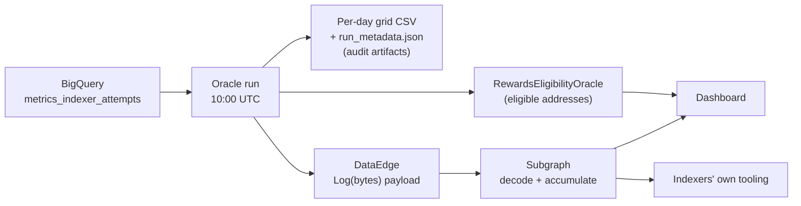

# Publishing per-day eligibility metrics

**Status:** Phases 1 and 2 are implemented in this repository. On-chain publishing stays switched off
until a DataEdge contract is deployed and `DATA_EDGE_CONTRACT_ADDRESS` is set. Phase 3 (subgraph) is
next and this document is its handover. Phase 4 (dashboard) has not started.
**Scope:** `rewards-eligibility-oracle`, a new subgraph, `rewards-eligibility-oracle-dashboard`

**If you are building the subgraph**, read [Analysis window](#analysis-window),
[Wire format](#wire-format) and [Phase 3 — subgraph](#phase-3--subgraph). The rest explains why the
oracle behaves the way it does.

## Problem

The oracle decides eligibility from 28 days of query data, then posts **only the eligible
addresses** on chain. Before Phase 1, everything that justified the decision was discarded at the
end of the run.

That leaves indexers with a single bit of information, and it is the wrong bit:

- `isEligible` reads identically for an indexer at 22 qualifying days and one at 5. The first is
  safe, the second is one bad day from lapsing, and neither can tell which they are.
- An ineligible indexer learns that it failed, not why. "No queries were routed to me" and
  "I served queries but every one was behind chainhead" are different problems with different
  fixes, and the contract shows them the same way.
- `MIN_SUBGRAPHS` changed from 1 to 5 on 2026-10-06. No indexer could determine beforehand whether
  that affected them, which made the notice period much less useful than intended.

## Goal

Publish per-indexer, per-day eligibility metrics so that indexers can see **how much margin they
have**, **why a day failed**, and **whether a pending criteria change affects them**, without
having to ask anyone.

Non-goal: changing what determines eligibility. This work does not alter the criteria, the
contract, or the renewal semantics.

## Shape of the solution



| Phase | What | State |
| --- | --- | --- |
| 1 | Oracle writes the per-day grid and a run manifest to disk | Implemented |
| 2 | Oracle publishes the trailing days of the grid to DataEdge | Implemented, disabled until a contract is deployed |
| 3 | Subgraph decodes payloads into entities | Next |
| 4 | Dashboard panels on top of the subgraph | Not started |

### On chain today

```solidity
renewIndexerEligibility(address[] indexers, bytes data) returns (uint256)
```

The oracle sends the eligible addresses in batches of `BATCH_SIZE` (125), halting on first
failure, and passes `data = 0x` on every call. The contract records `block.timestamp` per address
as the renewal time and emits `IndexerEligibilityRenewed(indexer, oracle)`. There is also an unused
`IndexerEligibilityData(address indexed oracle, bytes data)` event. No metrics exist on the rewards
contract, and this work does not add any there.

### Dashboard today

`rewards-eligibility-oracle-dashboard` reads **only the contract** (`isEligible` and
`getEligibilityRenewalTime` per address) into `reo.db`, and renders a static site. Its indexer
roster comes from a subgraph, so it already knows about ineligible indexers; it just has nothing
to say about them.

---

## Analysis window

Every number in this document is relative to one run's window. The exact bounds matter for any
rolling aggregate a consumer computes.

- A run for date `R` covers `window_start = R - BIGQUERY_ANALYSIS_PERIOD_DAYS` (28) to
  `window_end = R`, **inclusive at both ends: 29 calendar days**.
- Days are UTC calendar days taken from BigQuery's `day_partition`.
- The scheduled run fires at 10:00 UTC, so **day `R` is partial**: it holds about ten hours of data.
  The oracle's eligibility verdict for that run counts the partial day as it stood at 10:00. The
  next run republishes it in full (see [Post deltas](#post-deltas-not-the-window)).
- When the scheduler catches up a missed run, it runs it for yesterday (`R` = yesterday), so that
  run's final day is complete.
- An indexer is eligible when the number of days in the window with `is_online_day = 1` is at least
  `MIN_ONLINE_DAYS`.

---

## Phase 1 — the per-day grid (implemented)

Each run writes five files to `data/output/YYYY-MM-DD/` on a PVC (5 Gi, swept after
`MAX_AGE_BEFORE_DELETION` = 120 days). Three existed before this work and keep their shape:
`indexer_issuance_eligibility_data.csv` (window totals per indexer), `eligible_indexers.csv` and
`ineligible_indexers.csv`. Phase 1 added two.

### `indexer_daily_metrics.csv`

One row per indexer per day of the window, written by `EligibilityPipeline.write_daily_metrics`.

```csv
day,indexer,query_attempts,qualifying_queries,qualifying_subgraphs,failed_status,failed_latency,failed_blocks_behind,is_online_day
2026-09-24,0x32bb…157b,3184,2761,6,102,53,321,1
2026-09-24,0x474e…684c,29,0,0,0,2,29,0
2026-09-25,0x474e…684c,0,0,0,0,0,0,0
```

| Column | Meaning |
| --- | --- |
| `day` | `YYYY-MM-DD`, UTC |
| `indexer` | lowercase hex address, as stored in BigQuery |
| `query_attempts` | all attempts routed to this indexer that day |
| `qualifying_queries` | attempts meeting all three quality bars at once: `status = '200 OK'`, `response_time_ms < MAX_LATENCY_MS`, `blocks_behind < MAX_BLOCKS_BEHIND` |
| `qualifying_subgraphs` | distinct deployments with at least one qualifying query that day |
| `failed_status` | attempts where `status != '200 OK'` |
| `failed_latency` | attempts where `response_time_ms >= MAX_LATENCY_MS` |
| `failed_blocks_behind` | attempts where `blocks_behind >= MAX_BLOCKS_BEHIND` |
| `is_online_day` | 1 when `qualifying_queries >= 1 AND qualifying_subgraphs >= MIN_SUBGRAPHS`, under the thresholds active for that run |

The SQL that produces these is `BigQueryProvider._get_indexer_daily_metrics_query` in
[`src/models/bigquery_provider.py`](../src/models/bigquery_provider.py). The window totals CSV is
aggregated from the same rows in pandas, so there is one BigQuery scan.

### `run_metadata.json`

Makes each run's artifacts self-describing once criteria have changed, and records what reached the
chain:

```json
{
  "run_date": "2026-09-25",
  "window_start": "2026-08-28",
  "window_end": "2026-09-25",
  "criteria": { "MIN_ONLINE_DAYS": 5, "MIN_SUBGRAPHS": 1,
                "MAX_LATENCY_MS": 5000, "MAX_BLOCKS_BEHIND": 50000 },
  "source": "bigquery",
  "indexers_evaluated": 189,
  "indexers_eligible": 142,
  "published_tx": null,
  "published_days": []
}
```

- `source` is always `bigquery`. A run serving cached artifacts leaves the manifest of the run that
  produced them in place, so nothing ever writes another value.
- `published_tx` is `null` until the per-day metrics are confirmed on chain, and is then the
  explorer URL of the transaction. A later run uses it to tell a publish that has still to happen
  from one already done.
- `published_days` records which days that transaction actually carried, and is the authority on
  coverage. A run publishes only the selected days that had query attempts, so a confirmed publish
  does not imply the whole selection reached the chain. Inferring coverage from the run date would
  mark a held-back day as done. A run only reaches back over days that are *not* covered, so that
  day would never be retried before leaving the window.

Both new files are in `has_existing_processed_data`'s required list, so a cache hit cannot serve a
run whose grid or manifest is missing.

### Semantics that consumers must respect

These apply to the CSV and to the on-chain payload alike.

1. **The `failed_*` counts overlap.** One response can be both slow and behind chainhead and
   increments both. They are not components of a whole and must not be rendered as one.
2. **The `failed_*` counts do not explain every non-qualifying attempt.** An attempt with no
   recorded `response_time_ms` or `blocks_behind` (SQL `NULL`) breaches no bar, so it is counted in
   no `failed_*` column. It still fails to qualify, because the comparison is not true. So
   `query_attempts - qualifying_queries` can be larger than any `failed_*` count, and all three can
   be zero on a day with no qualifying queries.
3. **`query_attempts = 0` is a real row**, not missing data: the gateway routed nothing that day,
   which is a routing problem, not a serving problem. In the CSV, every indexer has a row for every
   day of the window. On chain, the zero row is encoded by absence (see
   [Wire format](#wire-format)).
4. **`is_online_day` is a historical record** computed with the thresholds of the run that produced
   it. To simulate other thresholds, recompute from `qualifying_queries` and `qualifying_subgraphs`.
   This works exactly for `MIN_SUBGRAPHS` and `MIN_ONLINE_DAYS`. It cannot work for
   `MAX_LATENCY_MS` or `MAX_BLOCKS_BEHIND`, because those decide what counts as qualifying in the
   first place.

### Evaluated indexers are those with at least one attempt

The oracle's only source is `metrics_indexer_attempts`, so its universe of indexers is exactly those
that received at least one query attempt somewhere in the window. An indexer routed nothing across
all 29 days appears in no artifact: not the daily grid, not the summary, not `indexers_evaluated`,
not the payload. The CSV densifies *within* that set, not beyond it.

This changes no outcome, since an indexer with no attempts has no online days and is ineligible
either way. But that indexer has the most to learn from "nothing was routed to you", so a consumer
should handle it.

**The roster belongs to the consumer.** Supplying one here would mean giving the oracle a second data
source (the network subgraph, or a staking query) purely to emit zeros. The dashboard already reads
its indexer roster from a subgraph, so it can render "in the network, no data at all" by noting which
of its own addresses are absent. If that turns out to be the wrong division of labour, adding the
roster to the oracle is a design change to make deliberately, not a bug fix.

### Artifact scope: the CSV stays window-scoped

Decided. The CSV covers the full window even though Phase 2 publishes only the trailing days, and
the two shapes stay independent of each other.

- **The decision being audited is window-scoped.** The on-chain write asserts that a set of
  addresses is eligible, which is a function of the whole window rather than of the run date. A
  single-day artifact cannot reproduce the verdict it sits beside.
- **The CSV is the fallback** for days when the DataEdge post fails, and the only record of days
  older than publishing can reach back to.
- **Overlapping windows expose restatements.** BigQuery can backfill. Comparing consecutive runs'
  view of the same day surfaces source data that moved; with single-day files a silent restatement
  is invisible.

The redundancy costs ~500 KB per run, ~60 MB across the 120-day sweep, against a 5 Gi volume. If
disk ever becomes a constraint the lever is `MAX_AGE_BEFORE_DELETION`, not the window.

---

## Phase 2 — publishing via DataEdge (implemented)

`EventfulDataEdge` accepts any calldata on its fallback and emits `Log(bytes data)`. It exists to
carry oracle payloads that a subgraph decodes, and block-oracle already uses this pattern in
production. The oracle sends the payload as the raw calldata of a plain transaction to the contract,
with no function selector and no ABI encoding, so the event's `data` is exactly the payload.

Code: [`src/models/data_edge_client.py`](../src/models/data_edge_client.py) sends,
[`src/utils/data_edge_codec.py`](../src/utils/data_edge_codec.py) encodes, and
`publish_daily_metrics_to_data_edge` in
[`src/models/rewards_eligibility_oracle.py`](../src/models/rewards_eligibility_oracle.py) decides
what to send.

### Configuration

| Key | Default | Meaning |
| --- | --- | --- |
| `DATA_EDGE_CONTRACT_ADDRESS` | `""` | Empty switches publishing off. The grid and manifest are still written. |
| `DATA_EDGE_PUBLISH_DAYS` | `2` | Trailing days each run publishes, before any catch-up. Must be at least 1. |
| `MAX_PUBLISH_CATCH_UP_DAYS` | `7` | Constant in code, not config. The furthest back any run reaches. |

The transaction is signed with the same `PRIVATE_KEY` as the renewals, so `transaction.from` on a
publish is the oracle's own address: the one that holds the oracle role on the
RewardsEligibilityOracle contract and appears as `oracle` in `IndexerEligibilityRenewed`.

### Why not the rewards contract's `data` parameter

It was considered and rejected. `renewIndexerEligibility(address[], bytes)` couples any payload to
the renewal transaction, which means:

- **Only eligible indexers get covered.** Adding an ineligible address to `indexers[]` to carry its
  data would grant it eligibility. The indexers who most need diagnosis are structurally excluded.
- **A zero-eligible day sends no transaction at all**, so no data is published.
- Sending renewal transactions for telemetry reasons touches `getLastOracleUpdateTime`, which is
  paired with `getOracleUpdateTimeout` and therefore almost certainly gates a liveness fail-safe. A
  telemetry transaction landing while the renewal path is broken would keep that clock fresh and
  mask the outage. Not acceptable on a rewards-critical contract.

DataEdge has none of these properties: no address coupling, no liveness signal, no governance or
audit surface on the rewards contract.

### Post deltas, not the window

On chain the subgraph accumulates state, so each run publishes only the **trailing days** of the
window. The encoder reads them from the in-memory grid, not from the CSV.

**Two trailing days by default** (`DATA_EDGE_PUBLISH_DAYS`). A run at 10:00 UTC sees only part of
its final day, so publishing that day alone would permanently understate it. Publishing an overlap
means the next run restates it in full. The same overlap covers a day whose own run failed, and a
day whose source data arrived late in BigQuery. Rows are keyed by `(indexer, day)` so restatement
is an upsert.

**Reaching back over days not yet on chain.** A run whose publish fails still succeeds, so nothing
re-runs it. Each run therefore reads `published_days` from the manifests of the previous 7 run
dates, finds the oldest day in `[window_end - 6, window_end]` that none of them covers, and widens
its selection back to that day. It never selects fewer than `DATA_EDGE_PUBLISH_DAYS` or more than 7
days.

**Turning publishing on backfills 7 days, and no more.** Runs made while the address was empty never
recorded a `published_tx`, so the first run after it is set finds all 7 reachable days uncovered and
publishes all of them (around 42 KB at 200 indexers). It draws them from its own BigQuery result,
not from older CSVs. Once that publish is confirmed, later runs drop back to the configured overlap.
Older days never reach the chain; publishing them would need a separate one-off job.

Coverage is read **per day, not per run**. A run that published only some of its selected days,
because one had no query attempts, records only those days, so the held-back day stays uncovered and
the next run selects it again. A day is retried only while it stays within the 7-day reach. A
held-back day on its last reachable run can never be published afterwards, so that case alerts
(OpsGenie P4) rather than just logging.

Measured payload sizes, 200 indexers with a full set of counters:

| Encoding | Per run |
| --- | --- |
| Raw CSV, full window | ~500 KB |
| Raw CSV, one day | ~18 KB |
| **Binary, 2 trailing days** | **~12 KB** (~30 bytes per indexer-day) |
| Binary, 7 days (first run, or catch-up) | ~42 KB |

**No address registry**, which is a change from the original sketch. Registering addresses once
and referring to them by index would cut a row from ~30 to ~10 bytes. But the oracle would then hold
registry state that must stay in lockstep with the subgraph's. If the two ever diverge (a lost state
file, a transaction the oracle recorded but that never landed, a wiped volume), every later payload
decodes against the wrong addresses, silently. Inline addresses are stateless and idempotent, and
the ~8 KB per run they cost is about the same as the calldata the oracle already sends to renew
eligibility. Revisit if the indexer set grows by an order of magnitude.

Dropping the registry also dropped the roster: nothing on chain lists who was evaluated, and an
indexer routed nothing across the *whole* window never appears in any payload. See
[Evaluated indexers](#evaluated-indexers-are-those-with-at-least-one-attempt).

### Operational behaviour

- **A dedicated DataEdge instance.** The fallback emits everything sent to it; a shared contract
  forces the subgraph to filter other payloads out of its event stream.
- **A separate transaction from renewals**, in both directions. Telemetry must never fail an oracle
  run. On a run where renewals fail, the diagnostic data is *more* valuable, so publishing does not
  depend on renewal success: the submission failure is held, the payload is published, and only
  then is the failure re-raised. A publishing failure logs and alerts (OpsGenie P4) rather than
  exiting 1.
- **Publishing runs after the renewal batches, not before.** Both sign with the same key, and
  renewals are submitted with `replace=True`, which takes the sender's oldest pending nonce. A
  publish still in flight would be replaced by them and silently dropped. Submitting renewals first
  leaves nothing of ours pending for them to evict. A separate signing account would remove the
  coupling properly, and is the right fix if one ever becomes available.
- **The contract must have code.** An address with no code would accept the payload as a plain
  transfer and emit nothing, so the client checks `eth_getCode` and refuses to send otherwise.
- **Reverts are not retried.** Provider rotation is right for a timeout or an unreachable node, but
  a revert is deterministic: rotating would mine, and pay for, the same failing transaction once per
  configured provider.
- **Signed once, sent through each provider in turn.** A send can fail after the node has already
  accepted the transaction, and signing a fresh one for the next provider would take a new nonce and
  could publish twice. Resending the same signed bytes cannot: a node that already has them turns
  them away as a duplicate ("already known"), which counts as sent. "Nonce too low" counts as sent
  only when the node has the transaction; otherwise another transaction took the nonce, and the next
  provider signs a fresh one. A provider that fails while waiting for the receipt hands over to the
  next, which resends and confirms the same transaction. A transaction not seen mined within the
  timeout, or that no provider could confirm, raises `DataEdgePendingError` carrying the hash,
  since it may still be mined.
- **A cache hit retries an unfinished publish, and only that.** A re-run inside the 30-minute cache
  window republishes nothing when the manifest has a `published_tx`, and publishes from the CSV when
  it does not. A retry publishes under the window and criteria in the manifest, not the current
  config, since those are what produced the grid.
- **Only a confirmed publish is recorded.** One broadcast without its outcome established stays
  unrecorded, so a later run retries it. **The subgraph can therefore see the same days, and even
  the same run, published twice.** A repeat is a restatement keyed by indexer and day, whereas an
  unrecorded loss cannot be recovered once the window moves on.
- **Missing data is not published as zeros, per day.** A selected day with no query attempts at all
  means its source data has not arrived, not that the whole network was idle, so that day is left
  out of the payload. It is held back on its own, so a day whose data is ready still goes out. Only
  when *no* selected day has data does the run skip publishing and alert (OpsGenie P4). So every
  payload that reaches the chain carries at least one day, and the days it carries need not be
  consecutive.

---

## Wire format

[`src/utils/data_edge_codec.py`](../src/utils/data_edge_codec.py) is the normative reference. Its
`decode_payload` mirrors what a subgraph mapping must do, and `tests/test_data_edge_codec.py`
asserts against it.

```
payload  := magic("RE" = 0x52 0x45) version(varint) message*
message  := tag(varint) body

0x01 RunInfo      := run_day, window_start_day, window_end_day,
                     indexers_evaluated, indexers_eligible
0x02 Criteria     := min_online_days, min_subgraphs, max_latency_ms, max_blocks_behind
0x03 DailyMetrics := day, row_count, row*
     row          := address(20 raw bytes), query_attempts, qualifying_queries, qualifying_subgraphs,
                     failed_status, failed_latency, failed_blocks_behind, is_online_day
```

- Every integer, tags included, is an **unsigned LEB128 varint** of at most 64 bits (at most 10
  bytes), so it decodes into a `u64`.
- Every day is **days since 1970-01-01** (UTC). 2026-09-25 is 20721.
- The payload has no length prefix or terminator: messages run to the end of the bytes.
- The current version is **1**. A decoder must refuse any other version, and any unknown tag,
  rather than guess.

What the encoder guarantees in version 1, which a decoder may rely on but should not need to:

- Exactly one `RunInfo`, then exactly one `Criteria`, then one or more `DailyMetrics`.
- `DailyMetrics` messages in ascending day order, each day at most once, all within
  `[window_start_day, window_end_day]`. Days are the trailing days of the window, but a held-back
  day leaves a gap.
- Within a day, rows sorted by address, each address at most once, and only rows with
  `query_attempts > 0`. **An indexer absent from a published day was routed nothing that day.**
- `is_online_day` is 0 or 1. `indexers_evaluated` counts indexers with at least one attempt in the
  window; `indexers_eligible` counts those the run found eligible, whether or not every renewal batch then
  succeeded.

Three properties to keep if the format is revised:

- **Magic bytes.** DataEdge's fallback accepts calls from *any* address, so the subgraph needs a way
  to ignore payloads it did not write. The magic is a cheap first filter, not authentication: the
  mapping must check `event.transaction.from` against the oracle address, since `Log(bytes)` does
  not carry a sender.
- **Criteria on every payload**, not only when they change. It costs ~6 bytes and makes each payload
  interpretable with no prior state: `is_online_day` means nothing without the thresholds that
  produced it.
- **An explicit version**, refused rather than guessed at when unrecognised. The subgraph is a
  deployed artifact that cannot be retroactively fixed.

### Test vector

Produced by `encode_payload` with two indexers over two days; the second indexer was routed nothing
on 2026-09-25, so it has no row there. 121 bytes:

```
52450101f1a101d5a101f1a101bd018e010205018827d0860303f0a10102111111111111111111111111111111111111
1111f018c915066635c1020122222222222222222222222222222222222222221d000000021d0003f1a1010111111111
11111111111111111111111111111111b009cc08040a005a01
```

(One hex string, wrapped for width.) It decodes to:

```
version 1
RunInfo   run 2026-09-25 (20721), window 2026-08-28 (20693) .. 2026-09-25 (20721),
          evaluated 189, eligible 142
Criteria  MIN_ONLINE_DAYS 5, MIN_SUBGRAPHS 1, MAX_LATENCY_MS 5000, MAX_BLOCKS_BEHIND 50000
2026-09-24 (20720), 2 rows
  0x1111…1111  attempts 3184, qualifying 2761, subgraphs 6, failed status/latency/blocks 102/53/321, online 1
  0x2222…2222  attempts 29,   qualifying 0,    subgraphs 0, failed status/latency/blocks 0/2/29,     online 0
2026-09-25 (20721), 1 row
  0x1111…1111  attempts 1200, qualifying 1100, subgraphs 4, failed status/latency/blocks 10/0/90,    online 1
```

To decode a real transaction's payload during development:

```python
from src.utils.data_edge_codec import decode_payload
decode_payload(bytes.fromhex("5245..."))
```

---

## Phase 3 — subgraph

Handover for whoever builds it. Nothing here is implemented yet; the entity shape is a starting
point, the rules under it are not optional.

### Data source

- **Contract:** the dedicated DataEdge instance (`DATA_EDGE_CONTRACT_ADDRESS`, not yet deployed).
- **Event:** `Log(bytes)`. Confirm the signature against the deployed contract's verified source.
- **Start block:** the deployment block of that instance.
- **Trusted sender:** the oracle's signing address, as configuration (for example a constant per
  network). Ignore any event whose `event.transaction.from` is not it. If the oracle key is ever
  rotated, this list has to change with it.
- **Network:** the oracle's chain: Arbitrum Sepolia (421614) for testnet, Arbitrum One (42161) for
  mainnet.

### Decoding must never abort the subgraph

Anyone can send anything to a DataEdge fallback. A mapping that aborts, or reads out of bounds, on a
malformed payload fails the subgraph deterministically, and it stays failed. So:

1. Check the sender, then the magic and version. Anything else: log and return.
2. Decode the **whole** payload into plain values before touching the store. Bounds-check every
   read. On any error (truncated varint, more than 10 varint bytes, unknown tag, row count running
   past the end), log and return without writing anything.
3. Only then write entities. A payload is applied completely or not at all.

### Rules for applying a payload

1. **A `DailyMetrics` message is a full snapshot of that day.** It lists every indexer with
   `query_attempts > 0` on that day as of that run. When a day already exists, an indexer stored for
   it but absent from the new message must be set to zero, not left as it was. Otherwise a
   restatement that removes an indexer is lost. Keeping the list of indexers per day on a `Day`
   entity makes that diff cheap.
2. **Last write wins, in block order.** Days are republished by the overlap, by catch-up, by a
   cached retry, and by a publish whose confirmation was lost. Every copy carries data at least as
   fresh as the last one the oracle had. The only out-of-order case is the scheduler's catch-up run
   for yesterday, and it carries complete data for that day.
3. **The same run can arrive twice.** Key per-transaction records by transaction hash and log index;
   key per-run records by `run_day` and upsert.
4. **The final day of a scheduled run is partial.** A day equal to the payload's `run_day`, published
   on that same UTC day, was cut off at about 10:00. Consider an `isFinal` flag (`day` before the
   block's UTC date) so consumers can tell a provisional day from a settled one. The next run
   replaces it.
5. **Absent days are not zero days.** A day missing from every payload may be one the oracle held
   back for lack of source data, or one older than the 7-day reach. Do not fill it with zeros for
   all indexers. Zeros come only from rule 1, inside a day that was published.
6. **Indexers routed nothing for the whole window never appear.** The subgraph cannot list them; a
   consumer with a roster can (see
   [Evaluated indexers](#evaluated-indexers-are-those-with-at-least-one-attempt)).

### Rolling aggregates and criteria changes

The point of the subgraph is that consumers do not sum 29 entities themselves, so keep per-indexer
rolling aggregates. Two traps:

- **Use the oracle's window**: `[run_day - 28, run_day]` of the latest run, 29 days inclusive (see
  [Analysis window](#analysis-window)), not "the last 28 days".
- **Old days keep the criteria they were published under.** The oracle recomputes all 29 days with
  the current thresholds on every run, but only republishes the trailing ones. After a criteria
  change, the subgraph's stored `is_online_day` for older days still reflects the old thresholds.
  Until those days roll out of the window, a naive sum of stored `is_online_day` disagrees with the
  oracle's verdict. Store the counters and recompute online days against the latest `Criteria`:
  - `MIN_SUBGRAPHS` and `MIN_ONLINE_DAYS` changes can be recomputed exactly from
    `qualifying_queries` and `qualifying_subgraphs`. This matters already: `MIN_SUBGRAPHS` went
    from 1 to 5 on 2026-10-06.
  - `MAX_LATENCY_MS` and `MAX_BLOCKS_BEHIND` changes cannot be, because they change what counts as a
    qualifying query. Days published before such a change stay approximate until they leave the
    window. Expose the criteria each day was published under so consumers can tell.

Even then, the subgraph is an explanation of the verdict, not the verdict. The contract
(`isEligible`, `getEligibilityRenewalTime`) stays the source of truth for eligibility.

### Suggested entities

- `Indexer`: address; rolling aggregates for the latest window (online days, qualifying days at
  each pending threshold if useful, last day with attempts).
- `IndexerDay`: id `indexer-day`; the six counters, `is_online_day` as published, the criteria it
  was published under, `isFinal`, and the payload that last wrote it.
- `Day`: the day, the indexers present in its latest snapshot, the payload that last wrote it.
- `Criteria`: the four thresholds, keyed by value, with the first and last run that used them.
- `Run`: `run_day`, window bounds, `indexers_evaluated`, `indexers_eligible`, criteria, the days it
  carried, transaction hash, block. Several payloads may share a `run_day` (rule 3).

Counters fit `u64` on the wire; `query_attempts` per indexer per day can be large, and sums across
the window larger, so use `Int8` or `BigInt` in the schema rather than `Int`.

Also worth indexing: the RewardsEligibilityOracle contract's `IndexerEligibilityRenewed` events.
Together they show the "qualified but not renewed" state described in Phase 4, which neither source
shows alone.

Once this exists, **indexers can query their own metrics directly** and build their own alerting
without the dashboard in the loop. That is a better outcome than a dashboard and is only available
on this path.

### Decisions left to the subgraph

- **Retention.** How long to keep `IndexerDay` beyond the 29-day window. Older entities do no harm
  to correctness, only to size.
- **Where it lives and who owns it.** See open questions.
- **Testing.** Use the [test vector](#test-vector) as a fixed unit test for the decoder, and payloads
  produced by `encode_payload` for the restatement and duplicate-run rules.

---

## Phase 4 — dashboard

Adds panels on top of the subgraph. The contract remains the source of truth for eligibility
itself; the subgraph is the source of truth for the metrics behind it.

| Panel | Derivation |
| --- | --- |
| Renewal forecast | rolling online days >= `MIN_ONLINE_DAYS` |
| Headroom | "18 of 29 days qualified, 5 required" |
| Decay warning | qualifying days about to roll off the back of the window |
| Window strip | `is_online_day` per day, with the partial day marked |
| Failure reason | `query_attempts == 0` -> not routed; else the dominant `failed_*`; all `failed_*` zero -> missing latency or chainhead data |
| Criteria simulator | re-tally `qualifying_queries >= 1 AND qualifying_subgraphs >= K` for pending `K` (`MIN_SUBGRAPHS` only) |
| Run health / data as-of | latest `Run` entity |

Two states worth rendering explicitly:

- **Qualified but not renewed.** Batches halt on first failure, so a partial run can leave an
  indexer that met the criteria un-renewed until the next day. The contract alone cannot
  distinguish this from failing to qualify; the subgraph plus the contract can.
- **Lapse, not revocation.** A renewal grants a fixed period and failing to qualify does not cut it
  short. Forecasts should say "will not be renewed at the next run", never "you will lose
  eligibility", and should show when the current period ends.

Deliberately excluded: good-response ratio and raw query volume as headline metrics. Neither
affects the verdict, and showing them beside it implies a quality bar that is not enforced. Also
excluded: cross-indexer leaderboards of failure rates, which invent a reputation system nobody has
agreed to. Network-wide aggregates ("142 of 189 indexers eligible") are fine and useful.

---

## Rejected alternatives

| Option | Why not |
| --- | --- |
| Post the full grid on chain | Events are readable only off chain, so this pays the most expensive storage medium for data no contract will ever read. ~25–50x current daily calldata, permanent, and 96% redundant with the previous day. |
| Payload on `renewIndexerEligibility` | Covers eligible indexers only; publishes nothing on a zero-eligible day; risks masking a stalled oracle via the liveness clock. See Phase 2. |
| Export CSVs to GCS, dashboard pulls | Workable, but needs a bucket, credentials and a write path, and serves only the dashboard. DataEdge plus a subgraph serves every consumer. |
| IPFS CID anchored on chain | Good integrity properties and much cheaper than posting data, but still requires hosting and pinning, and still leaves the data unqueryable without separate indexing. Superseded by DataEdge. |
| Dashboard queries BigQuery directly | Duplicates the eligibility logic in a second place. The two will drift, and the dashboard would then disagree with the artifact that justified the on-chain transaction. |

## Open questions

1. **Deploy a DataEdge instance** per network and set `DATA_EDGE_CONTRACT_ADDRESS`. Everything in
   Phase 2 is built and tested; this is the only thing standing between it and being live. Confirm
   the deployed contract's `Log(bytes)` signature at the same time, since the subgraph depends on it.
2. **Measure the real cost** of a ~12 KB DataEdge post on Arbitrum, and of the ~42 KB first post,
   before committing to a daily cadence. Block-oracle is a live in-house precedent. If it is
   expensive, the levers in order of preference are `DATA_EDGE_PUBLISH_DAYS` 2 -> 1, then the
   address registry.
3. **Where does the subgraph live, and who owns it?** It is the longest-tail deliverable and the
   hardest to change after deployment. The wire format is fixed in code, but it is only version 1
   until a mapping has actually been written against it.
4. **Testnet first.** Prove the full path on Arbitrum Sepolia (421614) (oracle publish, subgraph decode, restatement on the next run) before
   mainnet.
5. **Confirm the deployed RewardsEligibilityOracle source** on Arbiscan. This document reads
   `contracts/contract.abi.json`, not the implementation.

Resolved: the CSV artifact stays, and stays window-scoped, once the subgraph exists. See
[Artifact scope](#artifact-scope-the-csv-stays-window-scoped).
