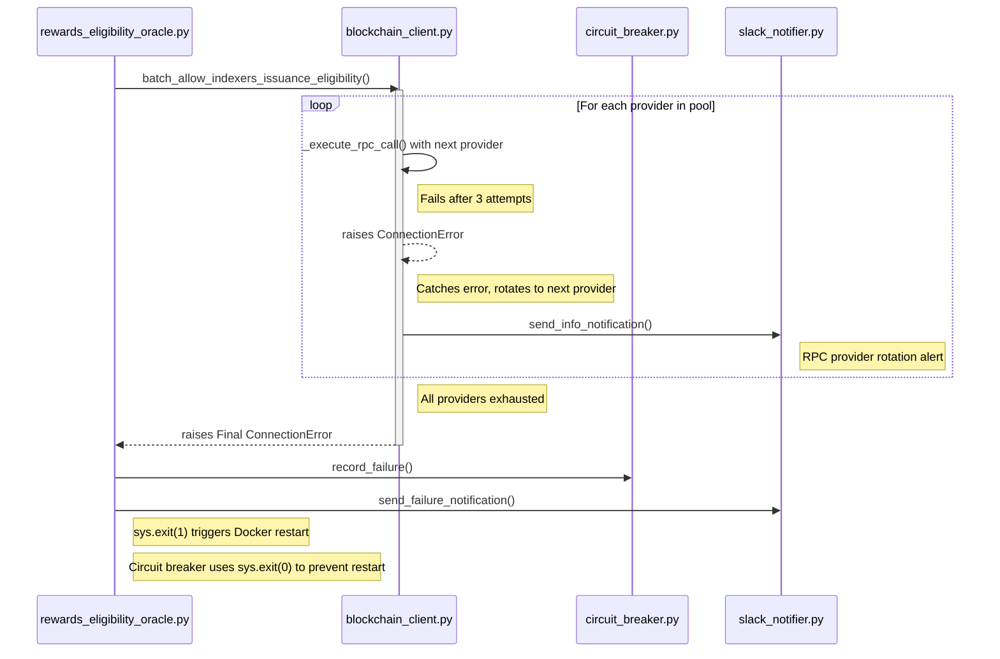

# Technical Design & Architecture

This document's purpose is to visually represent the Rewards Eligibility Oracle codebase, as a more approachable alternative to reading through the codebase directly.

## End-to-End Oracle Flow

The Rewards Eligibility Oracle operates as a daily scheduled service that evaluates indexer performance and updates on-chain rewards eligibility via function calls to the RewardsEligibilityOracle contract. The diagram below illustrates the complete execution flow from scheduler trigger through data processing to blockchain submission and error handling.

The Oracle is designed to be resilient to transient network issues and RPC provider failures. It uses a multi-layered approach involving internal retries, provider rotation, and a circuit breaker to prevent costly infinite restart loops that needlessly burn through BigQuery requests.

```mermaid
---
title: Rewards Eligibility Oracle - End-to-End Flow
---
%%{init: {'theme':'base', 'themeVariables': { 'primaryColor':'#fee2e2', 'primaryTextColor':'#7f1d1d', 'primaryBorderColor':'#ef4444', 'lineColor':'#6b7280'}}}%%

graph TB
    %% Docker Container - Contains all oracle logic
    subgraph DOCKER["Docker Container"]
        Scheduler["Python Scheduler"]
        Oracle["Rewards Eligibility Oracle"]

        subgraph CIRCUIT_BREAKER["Circuit Breaker Logic"]
            CB["Circuit Breaker"]
            CBCheck{"Has there been more<br/>than 3 failures in the <br/>last 60 minutes?"}
        end

        Scheduler -.->|"Triggers"| Oracle

        %% Data Pipeline
        subgraph PIPELINE["Data Pipeline"]
            CacheCheck{"Do we have recent cached<br/>BigQuery results available?<br/>(< 30 min old)"}

            subgraph BIGQUERY["BigQuery Analysis"]
                FetchData["Fetch Indexer Performance Data<br/>over last 28 days<br/>(from BigQuery)"]
                SQLQuery["- Daily query metrics<br/>- Days online calculation<br/>- Subgraph coverage"]
            end

            subgraph PROCESSING["Eligibility Processing"]
                ApplyCriteria["Apply Criteria e.g.<br/>5+ days online<br/>Latency < 5000ms<br/>Blocks behind < 50000<br/>1+ subgraph served"]
                FilterData["Filter Eligible<br/>vs Ineligible"]
                GenArtifacts["Generate CSV Artifacts:<br/>- eligible_indexers.csv<br/>- ineligible_indexers.csv<br/>- full_metrics.csv"]
            end
        end

        %% Blockchain Layer
        subgraph BLOCKCHAIN["Blockchain Submission"]
            Batch["Consume series of Eligible<br/>Indexers from CSV.<br/>Batch indexer addresses<br/>into groups of 125 indexers."]

            subgraph RPC["RPC Failover System"]
                TryRPC["Try establish connection<br/>with RPC provider"]
                RPCError["RPC Error Detected"]
                RPCFail{"All Providers<br/>Failed?"}
                Rotate["Rotate & Notify"]
            end

            BuildTx["Build Transaction:<br/>- Estimate gas<br/>- Get nonce<br/>- Sign with key"]
            SubmitTx["Submit Batch to Contract<br/>call function:<br/>renewIndexerEligibility()"]
            WaitReceipt["Wait for Receipt<br/>30s timeout"]
            MoreBatches{"More<br/>Batches?"}
        end

        %% Monitoring
        subgraph MONITOR["Monitoring & Notifications"]
            SlackSuccess["Slack Success:<br/>- Eligible count<br/>- Execution time<br/>- Transaction links"]
            SlackFail["Stop container sys.exit(0)<br/>Container will not restart<br/>Manual Intervention needed<br/>Send notification to team<br/>slack channel for debugging"]
            SlackRotate["Slack Info:<br/>RPC rotation"]
        end
    end

    %% External Systems - Define after Docker subgraph
    RPCProviders["Pool of 4 RPC providers<br/>(External Infrastructure)"]
    BQ["Google BigQuery<br/>Indexer Performance Data"]

    subgraph FailureLogStorage["Data Storage<br/>(mounted volume)"]
        CBLog["Failure log"]
    end

    subgraph HistoricalDataStorage["Data Storage<br/>(mounted volume)"]
        HistoricalData["Historical archive of<br/>eligible and ineligible<br/>indexers by date<br/>YYYY-MM-DD"]
    end

    END["FAILURE<br/>Container Stopped<br/>No Restart<br/>Team will investigate"]
    SUCCESS["SUCCESS<br/>Wait for next<br/>scheduled trigger"]

    %% Main Flow - Start with Docker container to anchor it left
    Oracle -->|"Phase 1.1: Check if oracle<br/>should run"| CB
    CB -->|"Phase 1.2: Read log"| CBLog
    CBLog -->|"Phase 1.3: Return log"| CB
    CB -->|"Phase 1.4: Provides failure<br/>timestamps (if they exist)"| CBCheck
    CBCheck -->|"Phase 2:<br/>(Regular Path)<br/>No"| CacheCheck
    CacheCheck -->|"Phase 2.1: Check for<br/>recent cached data"| HistoricalData
    HistoricalData -->|"Phase 2.2: Return recent eligible indexers<br/>from eligible_indexers.csv<br/>(if they exist)"| CacheCheck
    CBCheck -.->|"Phase 2:<br/>(Alternative Path)<br/>Yes"| SlackFail
    SlackFail -.-> END

    CacheCheck -->|"Phase 3:<br/>(Alternative Path)<br/>Yes"| Batch
    CacheCheck -->|"Phase 3:<br/>(Regular Path)<br/>No"| FetchData

    FetchData -->|"Phase 3.1: Query data<br/>from BigQuery"| BQ
    BQ -->|"Phase 3.2: Returns metrics"| SQLQuery
    SQLQuery -->|"Phase 3.3: Process results"| ApplyCriteria
    ApplyCriteria --> FilterData
    FilterData -->|"Phase 3.4: Generate CSV's"| GenArtifacts
    GenArtifacts -->|"Phase 3.5: Save data"| HistoricalData
    GenArtifacts --> Batch

    Batch -->|"Phase 4.1: For each batch"| TryRPC
    TryRPC -->|"Phase 4.2: Connect"| RPCProviders
    RPCProviders -->|"Phase 4.3:<br/>(Regular Path)<br/>RPC connection established"| BuildTx
    RPCProviders -.->|"Phase 4.3:<br/>(Alternative Path)<br/>RPC connection failed"| RPCError
    RPCError -->|"Rotate to next<br/>provider in pool"| Rotate
    Rotate -.->|"Notify"| SlackRotate
    Rotate -->|"All exhausted"| RPCFail
    RPCFail -->|"Yes<br/>Record failure timestamp<br/>sys.exit(1) triggers Docker restart"| SlackFail

    BuildTx --> SubmitTx
    SubmitTx --> WaitReceipt

    WaitReceipt -->|"Phase 4.4: Batch confirmed"| MoreBatches

    MoreBatches -->|"Yes<br/>Process next"| Batch
    MoreBatches -->|"Phase 5: No<br/>All complete"| SlackSuccess
    SlackSuccess --> SUCCESS

    %% Styling
    classDef schedulerStyle fill:#fee2e2,stroke:#ef4444,stroke-width:3px,color:#7f1d1d
    classDef oracleStyle fill:#fef3c7,stroke:#f59e0b,stroke-width:2px,color:#92400e
    classDef dataStyle fill:#f0fdf4,stroke:#16a34a,stroke-width:2px,color:#14532d
    classDef processingStyle fill:#e0e7ff,stroke:#6366f1,stroke-width:2px,color:#312e81
    classDef blockchainStyle fill:#fee2e2,stroke:#ef4444,stroke-width:2px,color:#7f1d1d
    classDef monitorStyle fill:#fef3c7,stroke:#f59e0b,stroke-width:2px,color:#92400e
    classDef infraStyle fill:#f3f4f6,stroke:#6b7280,stroke-width:2px,color:#374151
    classDef contractStyle fill:#dbeafe,stroke:#2563eb,stroke-width:3px,color:#1e3a8a
    classDef decisionStyle fill:#fef3c7,stroke:#f59e0b,stroke-width:2px,color:#92400e
    classDef endStyle fill:#7f1d1d,stroke:#991b1b,stroke-width:3px,color:#fee2e2
    classDef successStyle fill:#14532d,stroke:#166534,stroke-width:3px,color:#f0fdf4

    class Scheduler schedulerStyle
    class Oracle,CB oracleStyle
    class FetchData,SQLQuery,BQ dataStyle
    class ApplyCriteria,FilterData,GenArtifacts processingStyle
    class Batch,TryRPC,BuildTx,SubmitTx,WaitReceipt,Rotate,RPCError blockchainStyle
    class SlackSuccess,SlackFail,SlackRotate monitorStyle
    class RPCProviders,HistoricalData,CBLog infraStyle
    class Contract contractStyle
    class CacheCheck,RPCFail,MoreBatches,CBCheck decisionStyle
    class END endStyle
    class SUCCESS successStyle

    style DOCKER fill:#dbeafe,stroke:#2563eb,stroke-width:3px,color:#1e3a8a
    style CIRCUIT_BREAKER fill:#fef3c7,stroke:#f59e0b,stroke-width:2px,color:#92400e
    style PIPELINE fill:#f0fdf4,stroke:#16a34a,stroke-width:2px,color:#14532d
    style BIGQUERY fill:#dcfce7,stroke:#16a34a,stroke-width:2px,color:#14532d
    style PROCESSING fill:#e0e7ff,stroke:#6366f1,stroke-width:2px,color:#312e81
    style BLOCKCHAIN fill:#fee2e2,stroke:#ef4444,stroke-width:2px,color:#7f1d1d
    style RPC fill:#fecaca,stroke:#ef4444,stroke-width:2px,color:#7f1d1d
    style MONITOR fill:#fef3c7,stroke:#f59e0b,stroke-width:2px,color:#92400e
    style FailureLogStorage fill:#f3f4f6,stroke:#6b7280,stroke-width:2px,color:#374151
    style HistoricalDataStorage fill:#f3f4f6,stroke:#6b7280,stroke-width:2px,color:#374151
```

### Key Flow Points

**Daily Execution Trigger**
The scheduler runs daily at a scheduled time. On startup, it checks for missed runs and can catch up on yesterday's data if needed (limited to 7-day lookback for cost control).

**Circuit Breaker Protection**
Before each run, the circuit breaker checks for failure patterns. If 3 or more failures occurred in the last 60 minutes, the system halts cleanly to prevent infinite restart loops.

**Smart Caching**
The system checks for fresh cached data (< 30 minutes old) before querying BigQuery. This reduces costs and improves performance for reruns or troubleshooting scenarios.

**BigQuery Analysis**
When cache is unavailable, the system fetches 28 days of indexer performance data, analyzing query success rates, latency, sync status, and subgraph coverage to determine eligibility.

**Eligibility Criteria**
Indexers must meet all thresholds to be eligible for rewards:

- Active for 5+ days in the analysis period
- Query latency under 5000ms
- Blocks behind under 50000
- Serving at least 1 subgraph with successful queries

**Resilient Blockchain Submission**
Eligible indexers are batched (125 per transaction) and submitted on-chain. The RPC failover system automatically rotates through multiple providers with 3 attempts each, ensuring high availability despite provider outages.

**Comprehensive Monitoring**
Slack notifications provide real-time visibility into oracle operations, including success metrics, failure diagnostics, and infrastructure events like RPC provider rotation.

## RPC Provider Failover and Circuit Breaker Logic

The application is designed to be resilient to transient network issues and RPC provider failures. It uses a multi-layered approach involving internal retries, provider rotation, and an application-level circuit breaker to prevent catastrophic failures and infinite restart loops.

The following diagram illustrates the sequence of events when all RPC providers fail, leading to a single recorded failure by the circuit breaker.

